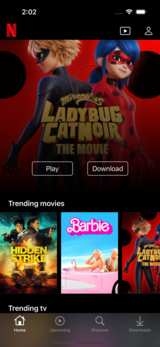
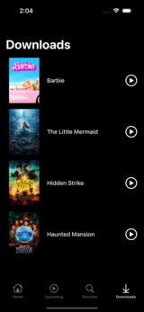

# iOS-NetflixClone-App
Netflix Clone app is project I make for my learning purpose. The app is an outcome from my learning through watching [iOS Development Course - Use Swift 5 and UIKit to Build a Netflix Clone](https://www.youtube.com/watch?v=KCgYDCKqato&list=PLHjN5X6EzI6Q__bBejCBOFfa8SFV876lS&index=9&t=12100s).

# Specs
* MVVM
* Programmatically UI (UIKit)
* [TheMovieDB API](https://developer.themoviedb.org/docs)
* [Youtube Data API](https://developers.google.com/youtube/v3)

# Preview

\

